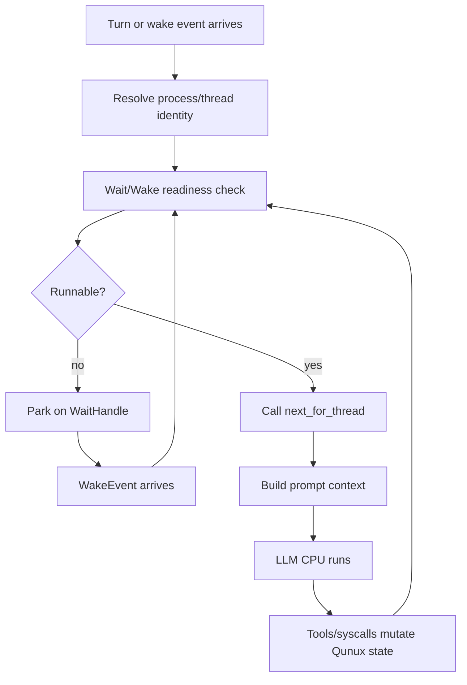

# Qunux Codex-Native Agent OS Runtime Model

This document defines Qunux as a Codex-native Agent OS runtime. It focuses on
the process, thread, task-closure, wait/wake, and scheduler model. Resource
exhaustion, natural process death, and long-term survival policy are
intentionally out of scope for now.

## Core Thesis

Qunux does not replace LLM reasoning. The LLM remains the intelligent CPU.
Qunux is the runtime that makes that CPU's work runnable, resumable, auditable,
recoverable, parallel, and structurally closed.

The runtime split is:

```text
Wait/Wake Kernel decides: can this thread run?
next scheduler decides: if runnable, what should it run?
LLM CPU decides: how should that instruction be executed?
```

This is the core Agent OS boundary. Runnable state is not a prompt convention
and not an LLM guess. It is a kernel-derived runtime property.

## Concept Map

```text
Codex core                         -> kernel
Root Codex agent session            -> Qunux process
Child Codex agent session           -> Qunux thread
Qunux closure state                 -> process memory + thread stacks
Task subtree                        -> thread-owned work package
Problem/ticket/result/check ledger  -> structured closure frame
Wait/Wake Kernel                    -> readiness and blocking IO kernel
WaitHandle                          -> blocking condition object
Run queue                           -> runnable thread set
Wait queue                          -> blocked thread set by handle kind
Wake event log                      -> event stream that resolves handles
next                                -> semantic scheduler frontier query
spawn_thread                        -> fork child session/thread
join_thread                         -> consume child result and resume parent
TUI cockpit                         -> terminal/process monitor
```

The root Codex session is the process boundary. A child Codex session created
through `qunux.spawn_thread` is a thread inside that process. There is no
additional actor layer in the product model. A Codex session is the execution
identity.

UI, app-server, native tools, timers, filesystem events, webhooks, and user
messages are kernel or device boundaries around Codex sessions. They are not a
separate user-level actor system.

## Process Model

A Qunux process is bound to one root Codex agent session:

```text
Codex session id -> Qunux process id -> .qunux/processes/<process>/closure.json
```

The process owns:

- thread table
- task tree
- ticket/result/check closure state
- wait handle table
- wait queues
- run queue
- wake event log
- input buffers
- context fork records
- audit events
- Codex session/thread identity bindings

Cases, tasks, and problems are process resources. They are not the process
itself. This lets one long-lived Codex session own durable work state while
Qunux controls which thread may mutate which subtree.

## Thread Model

A Qunux thread is a Codex agent session plus a bound task subtree.

Each thread has:

- a thread id
- a root problem id
- an optional parent thread id
- a Codex session binding
- ownership over its task subtree
- pending wait handles
- scheduler frontier metadata
- terminal result or failure state, when finished

The ownership rule is strict:

```text
A thread may only mutate problems, tickets, results, and checks inside its own
subtree.
```

After `spawn_thread`, the parent no longer writes inside the child-owned
subtree. The parent blocks on a child-thread wait handle. The child closes,
fails, or blocks independently. When the child reaches a visible completion or
failure state, the Wait/Wake Kernel resolves the parent's handle.

## Thread Readiness

Thread readiness is derived by the Wait/Wake Kernel. A thread is runnable only
if all of these are true:

```text
thread is not terminal
thread has a valid Codex session binding
thread has no unresolved blocking WaitHandle
thread has a valid scheduler frontier or pending input that can create one
```

The practical states are:

- `runnable`: the thread may be dispatched to the LLM CPU.
- `running`: the thread is currently inside model/tool execution. This is a
  transient dispatch state, not a semantic task state.
- `waiting`: the thread is parked on one or more unresolved wait handles.
- `terminal`: the thread is done, failed, canceled, or otherwise closed.

These states should be derived from thread records, wait handles, task closure,
and dispatch state. Manual status writes should be minimized because they create
invalid-state risk.

## Wait/Wake Kernel

The Wait/Wake Kernel owns thread readiness. It is not just a notification
service. It is the runtime subsystem that decides whether a thread is allowed to
run.

Its responsibilities are:

- create wait handles when a thread cannot proceed
- park threads by removing them from the run queue
- maintain wait queues by handle kind and condition
- accept wake events from Codex, tools, user input, timers, and external systems
- match wake events to wait handles
- resolve, cancel, or fail wait handles atomically
- move newly runnable threads back into the run queue
- expose wait reasons to status, render, dashboard, and TUI
- protect against lost wake, duplicate wake, and spurious wake behavior

The core loop is:

```text
thread needs input/result/event
  -> Wait/Wake Kernel creates WaitHandle
  -> thread enters waiting state
  -> thread leaves run queue
  -> Codex does not build prompt context for it

event arrives
  -> Wait/Wake Kernel records WakeEvent
  -> matching WaitHandle is resolved
  -> thread readiness is recomputed
  -> if runnable, thread enters run queue
  -> dispatch preflight may resume the LLM CPU
```

This is the rule:

```text
LLM does not poll.
Thread blocks.
Wait/Wake Kernel wakes.
Scheduler exposes the next runnable frontier.
```

## WaitHandle Model

A `WaitHandle` is the shared object between IO wait and wake. IO wait is the
blocked state. Wake is the event-driven state transition that resolves the
handle.

A handle should carry enough structure to be audited and resumed:

```text
WaitHandle {
  id
  owner_thread_id
  kind
  condition
  mode
  status
  producer
  payload_ref
  dedupe_key
  generation
  created_at
  resolved_at
  consumed_at
}
```

Handle kinds may include:

- `user_input`
- `child_thread`
- `tool_result`
- `approval`
- `timer`
- `file_event`
- `webhook`
- `external_signal`

Handle modes may include:

- `one`: a single matching event resolves the handle.
- `any`: any matching child condition resolves the handle.
- `all`: all listed conditions must resolve before the thread is runnable.

Handle statuses should be explicit:

- `pending`
- `ready`
- `consumed`
- `failed`
- `canceled`

The kernel should treat wake delivery as at-least-once. A repeated wake with the
same `dedupe_key` must not create duplicate progress. A spurious wake must only
trigger readiness recomputation, not unsafe execution.

## User Chat As IO

User conversation is standard input to the Qunux process.

A user message is not merely transcript text. It is an IO event:

```text
user message
  -> append to process/thread input buffer
  -> resolve matching user-input WaitHandle, if present
  -> recompute thread readiness
  -> thread becomes runnable if its blocking condition is gone
```

If no thread is explicitly waiting for user input, routing policy decides where
the input lands. The default should be the root thread unless a focused child
thread or UI selection says otherwise.

This makes "ask the user and wait" a first-class runtime operation instead of a
fragile prompt convention.

## Child Thread Waits

`spawn_thread` creates two things:

- a child Qunux thread bound to a child Codex session
- a parent `child_thread` wait handle

The parent blocks on the child handle. The child runs its subtree. When the
child closes successfully, fails, or exits early, the Wait/Wake Kernel records a
wake event and resolves or fails the parent handle.

Auto-join and explicit join are policies above the readiness layer:

- The Wait/Wake Kernel decides that the parent can run again.
- The scheduler decides whether the next parent action is `join_thread`,
  recovery, check, or another semantic step.

## Semantic Waits As Watcher Threads

Fuzzy or semantic wake behavior does not require a new kernel primitive.
The operational recipe is documented in
[`watcher-thread-pattern.md`](watcher-thread-pattern.md).

Do not add a `SemanticWaitHandle` to the Wait/Wake Kernel just because a goal is
soft, delayed, or judgment-heavy. Represent fuzzy wake as an ordinary child
thread with a watcher ticket.

The pattern is:

```text
parent thread
  -> creates a child problem with a watcher ticket
  -> spawn_thread(child problem)
  -> blocks on the normal child_thread WaitHandle

watcher child thread
  -> inspects the required signals
  -> judges the semantic criteria with an appropriate model
  -> records evidence in result/check bodies
  -> if criteria are met, closes the child problem
  -> if criteria are not met, waits for the next time window or input signal

Wait/Wake Kernel
  -> only sees ordinary child_thread, timer, tool_result, user_input, or
     external_signal handles
  -> wakes the parent when the watcher child reaches a visible terminal state
```

This keeps the boundary clean:

```text
Wait/Wake Kernel owns hard readiness.
Watcher thread owns semantic judgment.
next owns the next runnable instruction.
LLM CPU owns execution and review.
```

A watcher ticket should be explicit about:

- goal
- criteria
- signals to inspect
- evidence required before completion
- model/cost preference, such as using a cheaper model for repeated checks
- interval or trigger policy
- maximum attempts, deadline, or escalation condition
- what uncertainty should do, usually continue waiting or escalate to parent

The watcher must not silently pretend that "not yet" is completion. If the
condition is unmet, it records the observation and waits again. If the condition
is met, it records the evidence and closes through the normal ticket/result/check
loop. If the condition is ambiguous beyond its authority, it records a gap or
escalates through a follow-up.

In other words:

```text
Fuzzy wake is an agent pattern built from child thread + ordinary wait handles.
It is not a Wait/Wake Kernel feature.
```

## Tool And External IO

Synchronous tools may return within the current dispatch. Long-running or
external tools should be modeled as wait handles:

```text
tool starts
  -> create tool_result WaitHandle
  -> park thread if no immediate result exists

tool completes
  -> record payload
  -> resolve tool_result WaitHandle
  -> wake thread
```

The same model covers approvals, timers, filesystem events, webhooks, and
external system callbacks.

## Scheduler And next

`next` is the semantic scheduler. It does not own readiness and it must not
busy-wait.

The separation is:

```text
Wait/Wake Kernel:
  decides runnable | waiting | terminal

next:
  if runnable, returns the next semantic instruction
  if waiting, reports the wait reason for UI/debug
  if terminal, reports closure
```

`qunux.next` should remain a pure query. It can report that a thread is waiting,
but the actual blocking belongs to dispatch preflight and the Wait/Wake Kernel.

## Dispatch Preflight

Codex should check thread readiness before prompt context is assembled.



This is the key product behavior:

```text
No runnable thread, no prompt assembly, no model call.
```

The model should not spend tokens discovering that it is waiting. The runtime
already knows.

## Closure Model

Qunux uses a problem-package closure frame:

```text
Problem -> Ticket -> Result -> Check
```

The core invariant is:

```text
Ticket completion is not problem completion.
```

A ticket is done when the thread records a result. A problem is done only when a
success check proves that the original problem is closed, including split
children and follow-ups.

The recursive shape is:

```text
solve(problem):
  ticket = create_ticket(problem)
  classify(ticket)

  if ticket is one_go:
    result = execute(ticket)
  else:
    children = split(ticket)
    child_results = solve(children)
    result = summarize(child_results)

  record_result(ticket, result)

  loop:
    check = check_success(problem, accumulated_results)
    if check is success:
      return result_summary
    followup = check.followup
    accumulated_results.append(solve(followup))
```

Qunux enforces the closure shape as state transitions. The LLM performs the
intelligent work inside each runnable step.

## Native Tool Boundary

Qunux operations should be native tool calls, not shell commands.

The native tool boundary is the syscall surface:

- `current`
- `next`
- `create_problem`
- `create_ticket`
- `classify_ticket`
- `set_status`
- `result`
- `check`
- `spawn_thread`
- `join_thread`
- `status`
- `validate`
- `render`

The model should not pass process id or current thread id manually. Codex should
inject identity from the current session and runtime context. Manual identity is
a bug surface. Native identity injection is the OS boundary.

## Persistence Model

The durable process record should be able to reconstruct readiness after a
restart:

```text
.qunux/processes/<process>/closure.json
  threads
  problems
  tickets
  results
  checks
  wait_handles
  wait_queues
  run_queue
  wake_events
  input_buffers
  context_forks
  events
```

Some dispatch state may remain in memory, but enough wait/wake metadata should
be durable to avoid losing blocked work or wake events.

## UI Boundary

The TUI cockpit is the terminal/process monitor for Qunux. It should render:

- current process
- current thread
- run queue
- wait queues
- wait handles
- task tree
- scheduler frontier
- child handles
- input buffers
- recent wake events
- diagnostics

The TUI is not the source of truth. It renders runtime snapshots from Qunux
state.

## Failure And Race Rules

The Wait/Wake Kernel must be conservative around races:

- Lost wake: if an event arrives before a handle exists, the event must remain
  discoverable or be matched by condition during handle creation.
- Duplicate wake: repeated events with the same dedupe key must be idempotent.
- Spurious wake: a wake only causes readiness recomputation; it does not force
  unsafe execution.
- Stale handle: a handle for a terminal thread must be canceled or ignored.
- Parent/child race: parent joins only after the child state is visible and
  durable.
- Input race: user input must be attached to a process/thread buffer before the
  LLM sees it.

These rules are why Wait/Wake belongs in the kernel. They are too important to
leave to prompt discipline.

## Out Of Scope For This Document

The following are intentionally not solved here:

- resource exhaustion and natural process death
- external `qunuxd` daemon design
- generic multi-client actor architecture
- distributed scheduling
- long-term vector memory policy
- hostile multi-tenant permission model

The current core should stay sharp: Codex process, Codex thread, task closure,
Wait/Wake Kernel, scheduler frontier, native tools, and TUI cockpit.

## Design North Star

Qunux turns Codex from a chat loop into a process/thread/wait-wake/fork-join
runtime for LLM CPUs.

The operating principle is:

```text
The LLM CPU thinks.
Wait/Wake Kernel decides whether the CPU may run.
next tells the CPU what frontier is ready.
Qunux remembers, blocks, wakes, forks, joins, audits, and closes.
```
