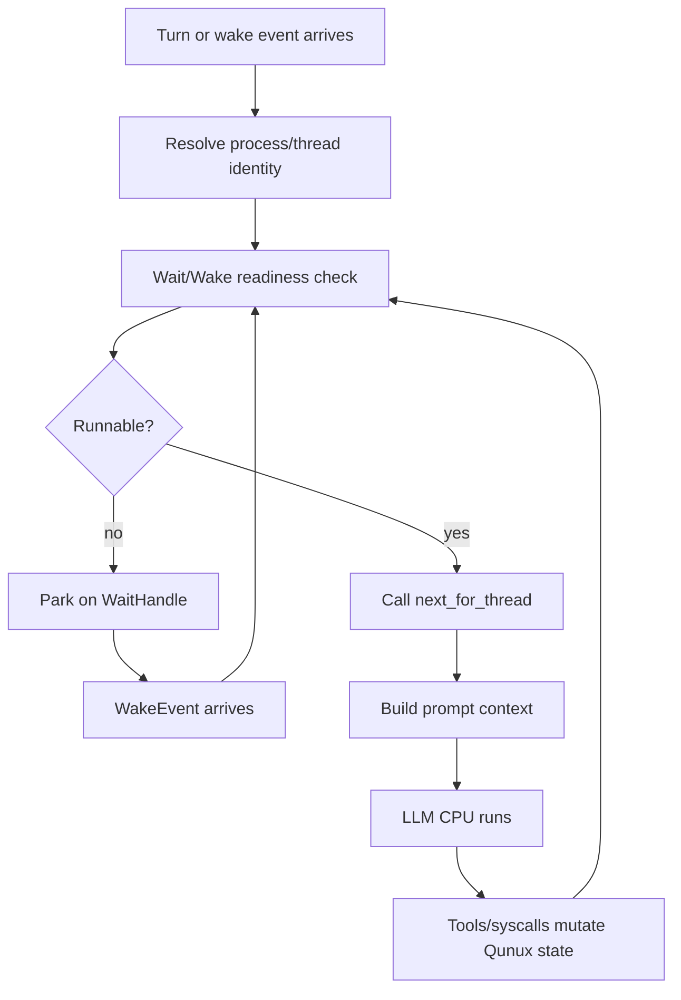

# Qunux Codex-Native Agent OS Runtime Model

This document defines Qunux as a Codex-native Agent OS runtime. It focuses on
the process, thread, task-closure, wait/wake, and scheduler model. Resource
exhaustion, natural process death, and long-term survival policy are
intentionally out of scope for now.

## Core Thesis

Qunux does not replace LLM reasoning. The LLM remains the intelligent CPU.
Qunux is the runtime that makes that CPU's work runnable, resumable, auditable,
recoverable, parallel, and structurally closed.

The runtime split is:

```text
Wait/Wake Kernel decides: can this thread run?
next frontier query reports: if runnable, what is the next legal instruction?
LLM CPU decides: how should that instruction be executed?
```

This is the core Agent OS boundary. Runnable state is not a prompt convention
and not an LLM guess. It is a kernel-derived runtime property.

Terms like Wait/Wake Kernel, Event Routing Agent, and scheduler name runtime
roles. In the current Codex-native implementation, those roles are realized by
Qunux durable state, Codex dispatch preflight, app-server/TUI input routing, and
host/device code. They do not imply an extra product actor layer or a separate
LLM service that thinks for the main LLM CPU.

## Concept Map

```text
Codex core                         -> kernel
Root Codex agent session            -> Qunux process
Child Codex agent session           -> Qunux thread
Qunux closure state                 -> process memory + thread stacks
Task subtree                        -> thread-owned work package
Problem/ticket/result/check ledger  -> structured closure frame
Wait/Wake Kernel                    -> readiness and blocking IO kernel
WaitHandle                          -> blocking condition object
Run queue                           -> runnable thread set
Wait queue                          -> blocked thread set by handle kind
Wake event log                      -> event stream that resolves handles
next                                -> semantic frontier query
spawn_thread                        -> fork child session/thread
qunux.wait                          -> agent-facing park syscall
join_thread                         -> compatibility sugar for child-thread consume
TUI cockpit                         -> terminal/process monitor
```

## Runtime Roles

Qunux separates four responsibilities:

```text
Root Agent          -> manages the task tree and decides what work should exist
Worker Agent        -> executes the current runnable task/thread instruction
Event Routing Agent -> listens to the world and normalizes raw events
Wait/Wake Kernel    -> deterministically decides which waits resolve
```

The Event Routing Agent is an architecture role, not necessarily a separate
process or autonomous model. It may be simple rules, UI routing, a webhook
adapter, a cheap LLM, or a hybrid. Its job is to translate messy input into a
structured `EventKey`:

```text
"PR 123 is green"        -> { kind: "github.pr.checks", resource: "123" }
"@QT003 here is reply"   -> { kind: "user.input", resource: "reply", target_thread_id: "QT003" }
timer callback           -> { kind: "timer", resource: "poll-window", target_thread_id: "QT000" }
```

The Event Routing Agent does not mark work done and does not directly wake
threads. It proposes normalized event input. The Wait/Wake Kernel is the
deterministic runtime role that then applies exact key matching, dedupe,
inbox/lost-wake handling, target validation, and handle readiness transitions.
The kernel output is a `WakeDecision`:

```text
WakeDecision {
  event_key
  status: matched | inboxed | duplicate
  matched_handle_ids
  runnable_threads
}
```

This split keeps semantic interpretation useful without letting semantic
interpretation bypass deterministic runtime state.

The root Codex session is the process boundary. A child Codex session created
through `qunux.spawn_thread` is a thread inside that process. There is no
additional actor layer in the product model. A Codex session is the execution
identity.

UI, app-server, native tools, timers, filesystem events, webhooks, and user
messages are kernel or device boundaries around Codex sessions. They are not a
separate user-level actor system.

## Process Model

A Qunux process is bound to one root Codex agent session:

```text
Codex session id -> Qunux process id -> .qunux/processes/<process>/closure.json
```

The process owns:

- thread table
- task tree
- ticket/result/check closure state
- wait handle table
- wait queues
- run queue
- wake event log
- input buffers
- context fork records
- audit events
- Codex session/thread identity bindings

Cases, tasks, and problems are process resources. They are not the process
itself. This lets one long-lived Codex session own durable work state while
Qunux controls which thread may mutate which subtree.

### Process Birth And Root Problem

When a Qunux process is created, runtime writes exactly one task-closure object:
the ordinary root problem `P000`.

`P000` is not a fake placeholder and not a special mission entity outside PTRC.
It is a normal problem whose body describes the process mission: serve the user
well in this Codex session. The mission can be rich, but the state model remains
plain problem/ticket/result/check.

At birth, Qunux does **not** create:

- a root ticket
- a `one_go` or `split` classification
- child problems
- results or checks
- wait handles

Those moves belong to the LLM CPU. The runtime provides durable state, legal
transitions, thread ownership, wait/wake mechanics, and scheduler frontier
queries. The agent reads the root problem, the current event, and `next`, then
decides the next legal PTRC action.

This is the universality rule:

```text
Qunux creates one root problem.
Qunux does not hardcode the solution strategy.
The LLM agent decides whether the next move is ticket creation, one_go, split,
child work, follow-up work, direct conversation, clarification, or wait.
The CLI/tool state machine decides whether the requested transition is legal.
```

This keeps the root mission powerful without introducing a second task model.
Long-running service behavior is expressed by normal PTRC choices made by the
agent, not by a special root problem type.

The process is headless-first. A TUI cockpit, chat transcript, shell session,
file watcher, webhook adapter, timer, or external tool can all be I/O surfaces
around the same process state. None of those surfaces is the process itself.
Visible assistant messages are output to the user; Qunux tool calls mutate or
inspect runtime state.

The TUI/OS protocol is therefore lane-based:

- durable runtime lane: Qunux owns problems, tickets, results, checks, threads,
  waits, handles, inbox items, passive events, and IO events;
- snapshot lane: app-server/runtime publishes `qunux/snapshot` for the cockpit
  to render without mutating state;
- input lane: TUI/chat input is offered as a `user_input` passive event that
  either wakes a wait or becomes an inbox item; actionable inbox items are
  converted into normal PTRC child problem/ticket packages with
  `qunux.scaffold_user_task`;
- visible output lane: assistant messages are user-visible stdout and are not
  implied by `qunux.ack_inbox` or any other state-only tool call;
- recovery lane: failed child-thread handles surface as `recover_thread`, which
  returns the unfinished subtree to the parent before retry or replacement.

Small-talk, acknowledgements, idle instructions, and narrow meta questions
should normally stay on the current thread. The LLM CPU should answer visibly,
acknowledge any inbox item, and park with `qunux.wait` if waiting is the right
state. It should not create a routing child problem or spawn a child thread just
to move conversation plumbing around.

The routing rule is intentionally ordinary:

- actionable input such as solve, implement, investigate, run, fix, design, or
  review becomes a normal child problem plus default solution ticket under the
  lifecycle root through `qunux.scaffold_user_task`;
- non-durable conversation such as small talk, acknowledgements, narrow meta
  questions, clarification, and explicit idle/wait instructions is answered in
  visible chat and then marked handled with `qunux.ack_inbox`;
- `qunux.ack_inbox` is state-only. It never sends visible output by itself, so
  the assistant must emit any user-facing reply separately.
- `qunux.ingest_user_task` remains the lower-level fallback when the agent
  intentionally needs a problem-only child and will author the ticket in a
  later legal PTRC step.

## Thread Model

A Qunux thread is a Codex agent session plus a bound task subtree.

The subtree is the durable call frame. The thread is only the live execution
cursor attached to that call frame. This distinction is important:

```text
ledger tree = durable world state
subtree     = auditable call frame / work package
thread      = executor cursor currently allowed to mutate that subtree
```

A thread may die, park, or be replaced while the subtree remains inspectable and
recoverable. A subtree may be reassigned only through an explicit recovery or
join transition. Parent threads wait for child subtree closure, not merely for a
child actor process to stop.

Each thread has:

- a thread id
- a root problem id
- an optional parent thread id
- a Codex session binding
- ownership over its task subtree
- pending wait handles
- scheduler frontier metadata
- terminal result or failure state, when finished

The ownership rule is strict:

```text
A thread may only mutate problems, tickets, results, and checks inside its own
subtree.
```

After `spawn_thread`, the parent no longer writes inside the child-owned
subtree. The parent blocks on a child-thread wait handle. The child closes,
fails, or blocks independently. When the child reaches a visible completion or
failure state, the Wait/Wake Kernel resolves the parent's handle.

## Thread Readiness

Thread readiness is derived by the Wait/Wake Kernel. A thread is runnable only
if all of these are true:

```text
thread is not terminal
thread has a valid Codex session binding
thread has no unresolved blocking WaitHandle
thread has a valid scheduler frontier or pending input that can create one
```

The practical states are:

- `runnable`: the thread may be dispatched to the LLM CPU.
- `running`: the thread is currently inside model/tool execution. This is a
  transient dispatch state, not a semantic task state.
- `waiting`: the thread is parked on one or more unresolved wait handles.
- `terminal`: the thread is done, failed, canceled, or otherwise closed.

These states should be derived from thread records, wait handles, task closure,
and dispatch state. Manual status writes should be minimized because they create
invalid-state risk.

## Wait/Wake Kernel

The Wait/Wake Kernel owns thread readiness. It is not just a notification
service. It is the runtime subsystem that decides whether a thread is allowed to
run.

Its responsibilities are:

- create wait handles when a thread cannot proceed
- park threads by removing them from the run queue
- maintain wait queues by handle kind and condition
- accept wake events from Codex, tools, user input, timers, and external systems
- match wake events to wait handles
- resolve, cancel, or fail wait handles atomically
- move newly runnable threads back into the run queue
- expose wait reasons to status, render, dashboard, and TUI
- protect against lost wake, duplicate wake, and spurious wake behavior

The core loop is:

```text
thread needs input/result/event
  -> Wait/Wake Kernel creates WaitHandle
  -> thread enters waiting state
  -> thread leaves run queue
  -> Codex does not build prompt context for it

event arrives
  -> Wait/Wake Kernel records WakeEvent
  -> matching WaitHandle is resolved
  -> thread readiness is recomputed
  -> if runnable, thread enters run queue
  -> dispatch preflight may resume the LLM CPU
```

This is the rule:

```text
LLM does not poll.
Thread blocks.
Wait/Wake Kernel wakes.
Scheduler exposes the next runnable frontier.
```

## Active And Passive Perception

Qunux separates two kinds of perception:

- Active perception: the LLM CPU deliberately calls a tool, reads a file, queries
  state, runs a command, or asks `next`.
- Passive perception: the process receives an event while a thread is not
  actively asking for it.

Passive perception is not "the agent remembers to check later." It is a kernel
input path:

```text
external input arrives
  -> Qunux normalizes it into a canonical EventKey
  -> Qunux records a PassiveEvent
  -> Qunux attempts to match the EventKey to pending WaitHandles
  -> matched handles become ready
  -> unmatched events remain in the inbox
  -> readiness is recomputed before prompt context is assembled
```

The first-class passive event kinds are:

- `user_input`: a human message, UI action, or reply directed at the process.
- `timer`: a durable time window or scheduled wake.
- `external_signal`: a webhook, filesystem signal, tool callback, or other
  system-level notification.

Threads do not listen to the world directly. A thread registers wait intent with
the Wait/Wake Kernel. The Event Routing Agent normalizes raw inputs from chat,
timers, webhooks, tool callbacks, or user-interface actions into canonical keys.
The Wait/Wake Kernel then matches those keys against registered handles.

Canonical keys are structured, not loose strings:

```text
EventKey {
  kind
  resource
  source
  target_thread_id
}
```

Examples:

```text
{ kind: "user.input", resource: "reply", source: "chat", target_thread_id: "QT003" }
{ kind: "timer", resource: "poll-window", source: "timer", target_thread_id: "QT000" }
{ kind: "github.pr.checks", resource: "123", source: "webhook", target_thread_id: null }
```

This gives Qunux a real event router:

```text
thread registers wait
  -> kernel stores WaitHandle.event_key
event arrives
  -> kernel computes PassiveEvent.event_key
  -> exact key + dedupe + eligibility match
  -> matching handle becomes ready
  -> owning thread becomes runnable
```

The root thread may register process-wide keys. Child threads should usually
register thread-scoped or subtree-scoped keys. A broad event must not wake a
child thread merely because the kind/resource/source are similar; the event key
must match the child thread's registered target or delegated capability.

The inbox is the anti-lost-wake buffer. If a passive event arrives before a
matching handle exists, Qunux preserves it as pending process memory instead of
dropping it. Later handle creation may consume it by matching the canonical
event key and dedupe key.

## WaitHandle Model

A `WaitHandle` is the shared object between IO wait and wake. IO wait is the
blocked state. Wake is the event-driven state transition that resolves the
handle.

A handle should carry enough structure to be audited and resumed:

```text
WaitHandle {
  id
  owner_thread_id
  kind
  event_key
  condition
  mode
  status
  producer
  payload_ref
  dedupe_key
  generation
  created_at
  resolved_at
  consumed_at
}
```

Handle kinds may include:

- `user_input`
- `child_thread`
- `tool_result`
- `approval`
- `timer`
- `file_event`
- `webhook`
- `external_signal`

Handle modes may include:

- `one`: a single matching event resolves the handle.
- `any`: any matching child condition resolves the handle.
- `all`: all listed conditions must resolve before the thread is runnable.

Handle statuses should be explicit:

- `pending`
- `ready`
- `consumed`
- `failed`
- `canceled`

The kernel should treat wake delivery as at-least-once. A repeated wake with the
same `dedupe_key` must not create duplicate progress. A spurious wake must only
trigger readiness recomputation, not unsafe execution.

## Agent-Facing Wait Syscall

The model-facing wait surface is one native tool:

```text
qunux.wait
```

It only means one thing:

```text
current thread cannot continue
  -> create wait handles from typed specs
  -> park current thread
  -> leave the runnable frontier
```

The LLM CPU declares what it is waiting for. It does not wake itself, consume
handles, cancel handles, or inspect wait internals through this syscall.

This keeps the syscall surface stable. New devices should add event-key kinds,
not new public tools:

```text
github.checks.completed
slack.message.received
calendar.time.arrived
file.changed
human.approval.received
child.thread.completed
```

The public data model is:

```text
WaitHandle = durable blocking object
EventKey   = canonical address of what can wake it
WakeEvent  = event routed into the kernel
```

The runtime and host still have internal operations for wake, consume, cancel,
and inspect. Those are kernel/device actions. They are not ordinary
agent-facing `qunux.wait` calls.

Examples:

```json
{
  "mode": "all",
  "reason": "Need user confirmation before deploy",
  "specs": [
    {
      "kind": "user_input",
      "condition": "continue-or-stop",
      "source": "chat",
      "dedupe_key": "deploy-confirm-P000"
    }
  ]
}
```

```json
{
  "mode": "all",
  "reason": "Wait for the next CI polling window",
  "specs": [
    {
      "kind": "timer",
      "condition": "ci-poll-window",
      "source": "timer"
    }
  ]
}
```

```json
{
  "mode": "all",
  "reason": "Wait for GitHub checks",
  "specs": [
    {
      "kind": "event_key",
      "event_key": {
        "kind": "github.checks.completed",
        "resource": "chriswangcq/qunux#42",
        "source": "github"
      }
    }
  ]
}
```

Wake is not ordinary task work. It is a kernel/device boundary used by Codex,
app-server, timers, webhooks, UI, or tests to inject a normalized passive event.
The LLM CPU should normally only create waits; host/runtime services should
wake and consume them.

`qunux.next` remains a pure query. It may report `wait_io` or `wait_thread`, but
it does not create waits and does not resolve waits.

## User Chat As IO

User conversation is standard input to the Qunux process.

A user message is not merely transcript text. It is an IO event:

```text
user message
  -> normalize to user.input EventKey
  -> append to process/thread input buffer
  -> resolve matching user-input WaitHandle, if present
  -> recompute thread readiness
  -> thread becomes runnable if its blocking condition is gone
```

If no thread is explicitly waiting for user input, routing policy decides where
the input lands. The default should be the root thread unless a focused child
thread, explicit `@thread`, or UI selection says otherwise.

This makes "ask the user and wait" a first-class runtime operation instead of a
fragile prompt convention.

### Fresh TUI Input Routing

For an explicit fresh TUI user message, the implemented Codex path is:

```text
TUI user input
  -> AppCommand::UserTurn
  -> AppEvent::CodexOp
  -> thread routing / app-server turn_start
  -> Qunux passive user-input offer
  -> ordinary core Op::UserInput only if Qunux does not consume the event
```

The important boundary is inside app-server `turn_start`, before ordinary core
turn submission. The app-server converts the fresh user input into a normalized
Qunux `user_input` passive event candidate and calls
`CodexThread::deliver_qunux_user_input`.

If that passive event matches a pending Qunux user-input wait:

- Qunux records the passive event.
- The matching wait handle becomes ready.
- The waiting thread becomes runnable.
- Codex schedules a Qunux dispatch turn.
- Normal `turn_start` user-input submission is suppressed for that request.

The matched wait may belong to the root thread or to a child thread inside the
same process. Current routing first asks Qunux which thread should receive a
`user_input` passive event, so a parent session input can wake a focused child
that is parked on a pending user-input wait. If no pending wait matches, the
event is preserved in the passive inbox instead of being dropped.

If Qunux is available but the event does not match a pending wait, Qunux stores
it in the passive inbox and exposes `handle_inbox` as runnable work. Codex then
schedules a Qunux dispatch turn and suppresses ordinary `turn_start` submission
for that request. The LLM CPU must inspect the inbox summary, decide whether it
is durable work, direct chat, clarification, or a new wait. Durable work is
normally converted into an ordinary child problem and default solution ticket
with `qunux.scaffold_user_task`; this is still canonical PTRC ledger state, not
a separate task model. Direct chat, clarification, and idle/wait instructions
should receive any needed visible assistant reply, then call `qunux.ack_inbox`
after incorporating that inbox item.

If the resulting Qunux dispatch turn performs only bookkeeping or acknowledges
the input without producing visible assistant text, Codex emits a visible
fallback message for the user instead of letting the UI look silent. That
fallback is scoped to user-input dispatch turns; it is not a general substitute
for normal assistant output.

If Qunux is unavailable or disabled, or the event is a duplicate, normal
`turn_start` proceeds with the ordinary user message.

This route is covered by subprocess-backed app-server JSON-RPC tests in
`app-server/tests/suite/v2/turn_start.rs`: one test verifies a matched
Qunux user-input wait suppresses ordinary chat and schedules a dispatch turn;
one test verifies no-wait inboxed input schedules `handle_inbox`; and one
fallback test verifies Qunux-disabled input still reaches ordinary chat.
Additional focused coverage verifies inboxed user input gets a visible fallback
when dispatch is ack-only, and core dispatch tests verify that visible fallback
stays limited to silent user-input dispatch turns.

Active-turn steering is a separate path. `turn_steer` input goes to the active
turn unless it is explicitly routed through Qunux in a future change. Do not
infer active-turn steering behavior from the fresh `turn_start` path.

Qunux snapshots, TUI cockpit render data, and model-visible Qunux tools are not
the primary route for fresh user input. They are observation and control
surfaces. The passive wait/wake offer is the IO boundary that decides whether a
fresh user message wakes Qunux or proceeds as ordinary chat.

## Child Thread Waits

`spawn_thread` creates two things:

- a child Qunux thread bound to a child Codex session
- a parent `child_thread` wait handle

The parent blocks on the child handle. The child runs its subtree. When the
child closes successfully, fails, or exits early, the Wait/Wake Kernel records a
wake event and resolves or fails the parent handle.

A child that parks on its own IO wait has not completed and has not failed. If
the parent reloads Qunux and still sees `wait_thread` for that child, but the
child thread is `waiting_io`, the correct state is parent parked on the child
handle while the child waits for user input, timer, tool output, or another wake
event. It must not be treated as a fatal "child actor finished but Qunux did not
advance" mismatch.

Auto-join and explicit join are policies above the readiness layer:

- The Wait/Wake Kernel decides that the parent can run again.
- The `next` frontier query reports whether the next parent action is
  `join_thread`, recovery, check, or another semantic step.

`join_thread` may remain as compatibility sugar, but the general model is that
ready handles are consumed by runtime/host resume logic.

## Semantic Waits As Watcher Threads

Fuzzy or semantic wake behavior does not require a new kernel primitive.
The operational recipe is documented in
[`watcher-thread-pattern.md`](watcher-thread-pattern.md).

Do not add a `SemanticWaitHandle` to the Wait/Wake Kernel just because a goal is
soft, delayed, or judgment-heavy. Represent fuzzy wake as an ordinary child
thread with a watcher ticket.

The pattern is:

```text
parent thread
  -> creates a child problem with a watcher ticket
  -> spawn_thread(child problem)
  -> blocks on the normal child_thread WaitHandle

watcher child thread
  -> inspects the required signals
  -> judges the semantic criteria with an appropriate model
  -> records evidence in result/check bodies
  -> if criteria are met, closes the child problem
  -> if criteria are not met, waits for the next time window or input signal

Wait/Wake Kernel
  -> only sees ordinary child_thread, timer, tool_result, user_input, or
     external_signal handles
  -> wakes the parent when the watcher child reaches a visible terminal state
```

This keeps the boundary clean:

```text
Wait/Wake Kernel owns hard readiness.
Watcher thread owns semantic judgment.
next exposes the next runnable instruction.
LLM CPU owns execution and review.
```

A watcher ticket should be explicit about:

- goal
- criteria
- signals to inspect
- evidence required before completion
- model/cost preference, such as using a cheaper model for repeated checks
- interval or trigger policy
- maximum attempts, deadline, or escalation condition
- what uncertainty should do, usually continue waiting or escalate to parent

The watcher must not silently pretend that "not yet" is completion. If the
condition is unmet, it records the observation and waits again. If the condition
is met, it records the evidence and closes through the normal ticket/result/check
loop. If the condition is ambiguous beyond its authority, it records a gap or
escalates through a follow-up.

In other words:

```text
Fuzzy wake is an agent pattern built from child thread + ordinary wait handles.
It is not a Wait/Wake Kernel feature.
```

## Tool And External IO

Synchronous tools may return within the current dispatch. Long-running or
external tools should be modeled as wait handles:

```text
tool starts
  -> create tool_result WaitHandle
  -> park thread if no immediate result exists

tool completes
  -> record payload
  -> resolve tool_result WaitHandle
  -> wake thread
```

The same model covers approvals, timers, filesystem events, webhooks, and
external system callbacks.

## Scheduler And next

`next` is the semantic frontier query over the current thread. It does not own
readiness, it does not wake or consume handles, and it must not busy-wait. The
runtime may use scheduler language for the frontier metadata, but the product
boundary is narrower: Wait/Wake and dispatch decide whether the LLM CPU may run;
`next` only describes the next legal instruction once that question is settled.

The separation is:

```text
Wait/Wake Kernel:
  decides runnable | waiting | terminal

next:
  if runnable, returns the next semantic instruction
  if waiting, reports the wait reason for UI/debug
  if terminal, reports closure
```

`qunux.next` should remain a pure query. It can report that a thread is waiting,
but the actual blocking belongs to dispatch preflight and the Wait/Wake Kernel.

## Dispatch Preflight

Codex should check thread readiness before prompt context is assembled.



This is the key product behavior:

```text
No runnable thread, no prompt assembly, no model call.
```

The model should not spend tokens discovering that it is waiting. The runtime
already knows.

## Closure Model

Qunux uses a problem-package closure frame:

```text
Problem -> Ticket -> Result -> Check
```

The core invariant is:

```text
Ticket completion is not problem completion.
```

A ticket is done when the thread records a result. A problem is done only when a
success check proves that the original problem is closed, including split
children and follow-ups.

The recursive shape is:

```text
solve(problem):
  ticket = create_ticket(problem)
  classify(ticket)

  if ticket is one_go:
    result = execute(ticket)
    # execution may create runtime child problems with mode=spawn
    # when it discovers a blocking subprogram
  else:
    children = split(ticket)
    child_results = solve(children)
    result = summarize(child_results)

  record_result(ticket, result)

  loop:
    check = check_success(problem, accumulated_results)
    if check is success:
      return result_summary
    followup = check.followup
    accumulated_results.append(solve(followup))
```

Qunux enforces the closure shape as state transitions. The LLM performs the
intelligent work inside each runnable step.

Child problem creation has three separate meanings:

- `mode=split`: plan-time child creation from a `split` ticket in
  `splitting`.
- `mode=spawn`: run-time subprogram creation from an executing `one_go`
  ticket.
- follow-up: check-time repair from a `not_success` check.

These are not interchangeable. Split is planned decomposition, spawn is a
runtime call/fork discovered during execution, and follow-up is verification
repair. A ticket cannot record its result until all child problems created from
that ticket are closed.

### Cheap Ledger Creation Layer

Qunux should make ledger-backed work cheap to create without making the ledger
optional. The goal is:

```text
complete audit detail, low agent operation cost
```

High-level creation syscalls may scaffold canonical ledger packages, but they
must not create a separate hidden task model. A cheap syscall is allowed to
write ordinary `Problem` and `Ticket` records, Markdown bodies, provenance, and
thread ownership in one operation. It is not allowed to mark a ticket done,
record a result, run a success check, or imply that verification happened.

The first cheap operation is `qunux.scaffold_user_task`, a child task package
creation syscall:

```text
scaffold_user_task(inbox_item, problem_body, default_ticket_body)
  -> create child problem under parent
  -> attach provenance and owner_thread_id
  -> create the single solution ticket for that child
  -> leave the ticket ready for classify/execute/split
```

This lowers the cost of saying "make this a real ledger-backed task" while
keeping the original closure loop intact:

```text
cheap create: problem + ticket scaffold
mandatory closure: classify -> execute/split -> result -> check
```

Use the cheap layer when the agent needs to turn actionable user input or a
discovered subtask into durable work quickly. Use low-level PTRC calls when the
agent needs unusual provenance, manual split/spawn semantics, or exact control
over each transition. In all cases, `next` remains the source of truth for what
the current thread may do next.

## Native Tool Boundary

Qunux operations should be native tool calls, not shell commands.

The native tool boundary is the syscall surface:

- `current`
- `next`
- high-level task creation syscalls that scaffold canonical ledger packages
- `create_problem`
- `create_ticket`
- `classify_ticket`
- `set_status`
- `result`
- `check`
- `spawn_thread`
- `wait`
- `join_thread`
- `status`
- `validate`
- `render`

The model should not pass process id or current thread id manually. Codex should
inject identity from the current session and runtime context. Manual identity is
a bug surface. Native identity injection is the OS boundary.

## Persistence Model

The durable process record should be able to reconstruct readiness after a
restart:

```text
.qunux/processes/<process>/closure.json
  threads
  problems
  tickets
  results
  checks
  wait_handles
  wait_queues
  run_queue
  wake_events
  input_buffers
  context_forks
  events
```

Some dispatch state may remain in memory, but enough wait/wake metadata should
be durable to avoid losing blocked work or wake events.

## UI Boundary

The TUI cockpit is the terminal/process monitor for Qunux. It is the status
channel for the Agent OS. It should render:

- current process
- current thread
- agent-loop state
- current frontier state: `runnable`, `io_wait`, or `terminal`
- run queue
- wait queues
- wait handles
- task tree
- scheduler frontier
- child handles
- input buffers
- recent wake events
- diagnostics

When a thread is parked on IO, the cockpit should render the dispatch state as
`parked_io` and show the associated wait and handle rows. That makes user-input
waits, child-thread waits, timer waits, and passive-event routing inspectable
without asking the model to call `qunux.next` just to discover that it cannot
run yet.

The chat transcript is the IO and narrative channel. User messages are process
input. Assistant messages are LLM CPU output. Qunux tool/runtime messages may
appear in chat when they are useful human-facing narration, for example:

```text
Qunux: spawned thread QT003 for P007
Qunux: QT000 is waiting for user_input
Qunux: passive event PE004 woke QT000
Qunux: QT003 completed; parent can join
Qunux: QT003 failed; parent can recover_thread
```

The TUI is not the source of truth. It renders runtime snapshots from Qunux
state. Chat messages are not the source of truth either; they narrate selected
runtime events while durable state remains in Qunux.

## Failure And Race Rules

The Wait/Wake Kernel must be conservative around races:

- Lost wake: if an event arrives before a handle exists, the event must remain
  discoverable or be matched by condition during handle creation.
- Duplicate wake: repeated events with the same dedupe key must be idempotent.
- Spurious wake: a wake only causes readiness recomputation; it does not force
  unsafe execution.
- Stale handle: a handle for a terminal thread must be canceled or ignored.
- Parent/child race: parent joins only after the child state is visible and
  durable.
- Input race: user input must be attached to a process/thread buffer before the
  LLM sees it.

These rules are why Wait/Wake belongs in the kernel. They are too important to
leave to prompt discipline.

## Out Of Scope For This Document

The following are intentionally not solved here:

- resource exhaustion and natural process death
- external `qunuxd` daemon design
- generic multi-client actor architecture
- distributed scheduling
- long-term vector memory policy
- hostile multi-tenant permission model

The current core should stay sharp: Codex process, Codex thread, task closure,
Wait/Wake Kernel, scheduler frontier, native tools, and TUI cockpit.

## Design North Star

Qunux turns Codex from a chat loop into a process/thread/wait-wake/fork-join
runtime for LLM CPUs.

The operating principle is:

```text
The LLM CPU thinks.
Wait/Wake Kernel decides whether the CPU may run.
next tells the CPU what frontier is ready.
Qunux remembers, blocks, wakes, forks, joins, audits, and closes.
```
